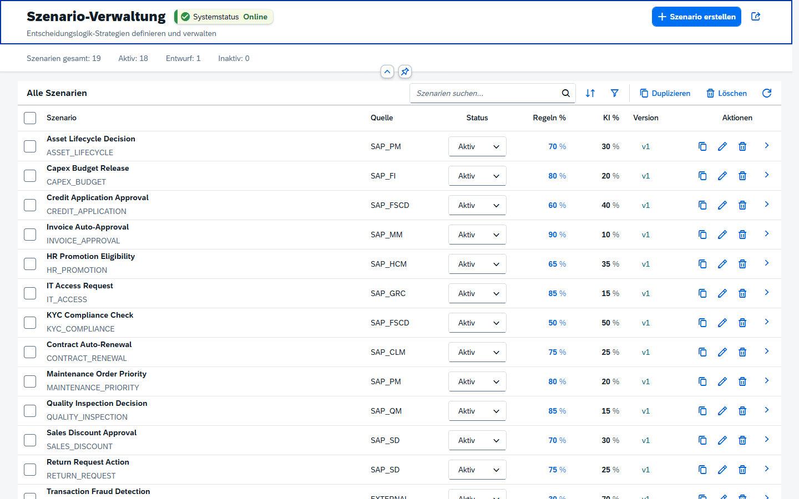
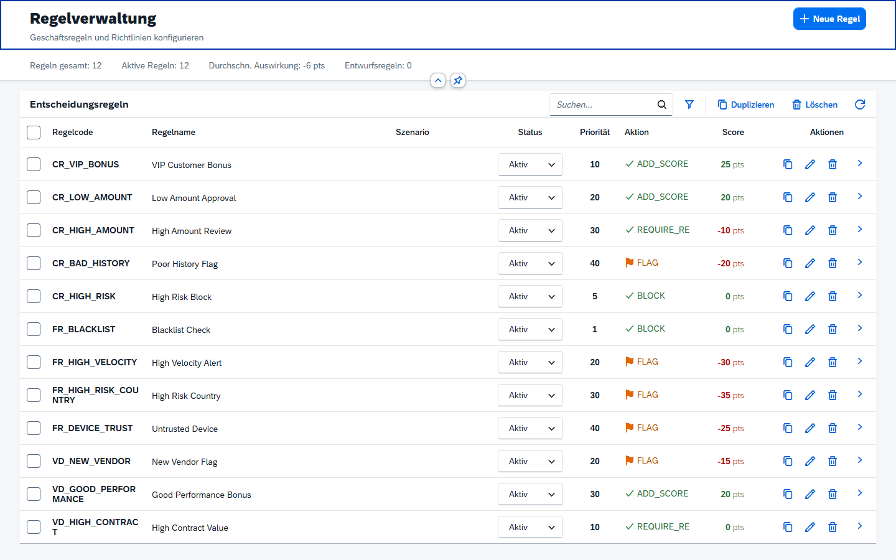
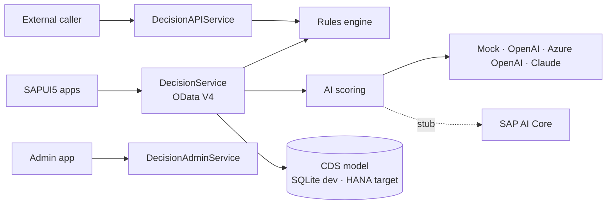

# DecisionCore AI

**Portfolio / reference implementation for explainable, rule-based decision support on SAP BTP.**
Built with the SAP Cloud Application Programming Model (CAP): business rules are configured as data,
an optional AI score can be blended in, and every decision returns a traceable score breakdown.

   

## What it does

A business user defines a **decision scenario** (for example invoice approval or vendor risk), configures
**rules** for it, and chooses how much weight rules and AI get (for example 70 % / 30 %). Requests are
evaluated via OData actions or a REST-style API and return:

- a decision (`APPROVED`, `REJECTED`, `REVIEW`, …), final score and confidence
- the rules score and the AI score separately
- a plain-text explanation and an entry in the decision history (audit trail)

## Screenshots

Local run (`cds serve`, in-memory database with the sample data from `db/data/`):





## Implemented vs. planned

| Area | Status |
|---|---|
| CDS data model: scenarios, rules, decisions, templates, AI providers | ✅ Implemented (`db/`) |
| Rules engine: expression and field-based rules; actions `ADD_SCORE`, `SET_DECISION`, `BLOCK`, `FLAG`, `REQUIRE_REVIEW` | ✅ Implemented (`srv/lib/rules-engine.js`) |
| Decision service: evaluate, simulate, batch evaluation, dashboard statistics, top rules, trends | ✅ Implemented (`srv/decision-service.js`) |
| Scenario lifecycle: publish, archive, duplicate, new version, create from template, import/export | ✅ Implemented |
| Role-based authorization (`DecisionAdmin`, `DecisionBusiness`, `DecisionViewer`) with `@requires` and XSUAA descriptor | ✅ Implemented (`srv/services.cds`, `xs-security.json`) |
| 18 scenario templates (FI, MM, SD, PM, QM, HCM, GRC, EWM, TM, …) as sample data | ✅ Implemented (`db/data/`) |
| 7 SAPUI5 apps (launchpad, dashboard, scenarios, rules, execute, history, admin) with i18n in 8 languages | ✅ Implemented (`app/`) |
| AI provider adapters: heuristic mock, OpenAI, Azure OpenAI, Anthropic Claude, with automatic fallback to the mock | ✅ Implemented (`srv/lib/ai/`) — live endpoints need your own API keys |
| SAP AI Core provider | 🟡 Stub — falls back to the heuristic provider |
| MTA descriptor for SAP BTP Cloud Foundry | 🟡 Included (`mta.yaml`) |
| Automated tests | 🔲 Planned — Jest is configured, test suites still to be written |
| Sample data: link the seeded rules to the seeded scenarios | 🔲 Known issue — the sample rules reference scenario IDs (`scn-credit-001`, …) that are not in the scenario sample data, so simulations on sample data trigger no rules |
| Launchpad / dashboard KPIs from live data | 🔲 Known issue — the launchpad tiles and some dashboard percentages are static placeholders |
| Integration with S/4HANA, SuccessFactors or Ariba | 🔲 Planned — not implemented |
| Learning from decision history (ML) | 🔲 Planned |

## Architecture



The final score is `rules score × rules weight + AI score × AI weight`; the weights are configured
per scenario and must add up to 100 %.

## Tech stack

SAP CAP (Node.js, CDS 9) · OData V4 · SAPUI5 · Fiori annotations · XSUAA · MTA / Cloud Foundry ·
SQLite (development) · SAP HANA Cloud (production profile)

## Quick start (local)

```bash
git clone https://github.com/enwecklerpro/decisioncore-ai.git
cd decisioncore-ai
npm install
npm run watch        # cds watch → http://localhost:4004
```

### Local development users

Authentication runs in CAP's `mocked` mode locally. These users exist **only for local development**
and are not used on SAP BTP, where XSUAA is required:

| User | Password | Roles |
|---|---|---|
| admin | admin | DecisionAdmin, DecisionBusiness, DecisionViewer |
| business | business | DecisionBusiness, DecisionViewer |
| viewer | viewer | DecisionViewer |

### Optional: AI providers

Copy `.env.example` to `.env` and set the keys of the providers you want to use
(`OPENAI_API_KEY`, `AZURE_OPENAI_*`, `ANTHROPIC_API_KEY`). Without keys, the heuristic mock provider is used.

## API example

```http
POST /api/decision/EvaluateDecision
Content-Type: application/json

{
  "scenarioName": "CREDIT_APPLICATION",
  "payload": "{\"amount\": 25000, \"riskLevel\": 3}",
  "isSimulation": true
}
```

```json
{
  "decision": "APPROVED",
  "confidence": 82,
  "finalScore": 71,
  "rulesScore": 68,
  "aiScore": 75,
  "explanation": "Score 71/100 based on: Low risk profile, Good history..."
}
```

Other functions: `getDashboardStats()`, `getTopRules(scenarioName, limit)`, `getDecisionTrend(days)`,
`getScenarioStatistics(scenarioName)`, `healthCheck()`.

## Rule configuration

Expression-based:

```javascript
amount > 10000 && riskLevel < 5
customerType == 'VIP' || amount <= 1000
country IN ('DE', 'FR', 'US')
```

Field-based:

| Field | Operator | Value | Action | Score |
|---|---|---|---|---|
| amount | GT | 50000 | FLAG | -10 |
| riskLevel | GTE | 8 | BLOCK | – |
| customerType | EQ | VIP | ADD_SCORE | +20 |

## Deploying to SAP BTP (Cloud Foundry)

Prerequisites: SAP BTP subaccount with Cloud Foundry, `cf` CLI, Cloud MTA Build Tool (`mbt`).

```bash
mbt build -t ./
cf login
cf deploy decisioncore-ai_<version>.mtar
```

Then assign the role collections for `DecisionAdmin`, `DecisionBusiness` and `DecisionViewer`
in the BTP cockpit (Security → Users).

## Project structure

```
db/    CDS data model and sample data (scenarios, rules, templates, providers)
srv/   CDS services, service handlers, rules engine, AI provider adapters
app/   SAPUI5 apps and Fiori annotations
```

## Roadmap

1. Automated tests for the rules engine and decision service (Jest)
2. SAP AI Core provider via the BTP destination service
3. Deployment and verification on a BTP trial subaccount, with screenshots
4. Learning from decision history

## Author

**Taha Khattari** — [LinkedIn](https://www.linkedin.com/in/taha-khattari/) · [GitHub](https://github.com/enwecklerpro)

## License

© 2026 Taha Khattari. All rights reserved.
